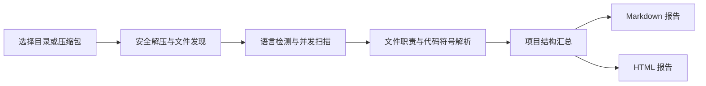

# ProjectQuickStar

ProjectQuickStar 是一个面向企业项目接手、代码审计和技术调研场景的桌面源码分析工具。它可以扫描本地项目目录或压缩包，在不执行目标代码的前提下，识别项目技术栈、目录组成、文件职责和代码符号，并生成可阅读、可分享的 Markdown 与 HTML 分析报告。

当你进入一家新公司、接手历史系统，或面对缺少文档的大型代码库时，可以先使用 ProjectQuickStar 建立项目全局视图，再沿接口层、业务层和数据访问层逐步阅读源码。

> 当前版本完成了项目扫描、静态代码摘要和报告生成。MySQL、Redis、MQ、服务调用链与 AI 深度解释


## 核心能力

- 通过 PyQt6 图形界面选择本地目录或项目压缩包。
- 支持 ZIP、TAR、TAR.GZ、TGZ 和 RAR 项目包。
- 自动检测 Python、Java、PHP、Go 和 JavaScript/TypeScript 源码。
- 多线程读取文件元数据，大型扫描任务不会阻塞 GUI。
- 支持暂停、继续和取消正在运行的分析任务。
- 自动排除 `.git`、虚拟环境、`node_modules`、构建产物等噪声目录。
- 分析文件职责、代码行数、导入依赖、类、接口、函数和方法。
- 识别常见配置项以及 SQL 表结构/数据操作语句。
- 自动生成 Markdown 和独立 HTML 报告。
- 对 ZIP/TAR 路径穿越、压缩包符号链接和项目符号链接进行安全防护。

## 工作流程



ProjectQuickStar 只进行静态读取，不会导入、编译或执行被分析项目中的任何源码。

## 支持范围

### 项目输入

| 输入方式 | 支持情况 | 说明 |
|---|---|---|
| 本地目录 | 支持 | 直接扫描现有项目目录 |
| ZIP | 支持 | 使用 Python 标准库解压并检查路径穿越 |
| TAR / TAR.GZ / TGZ | 支持 | 拒绝不安全路径和归档符号链接 |
| RAR | 支持 | 需要 `rarfile` 以及系统解压后端 |

### 源码与配置分析

| 类型 | 识别内容 | 实现方式 |
|---|---|---|
| Python | import、类、函数、异步函数、参数、文档字符串、代码行号 | Python `ast` |
| Java | import、类、接口、枚举、Record、方法 | 静态模式解析 |
| JavaScript / TypeScript / Vue | import、类、普通函数、箭头函数 | 静态模式解析 |
| PHP | use/require/include、类、接口、Trait、函数和方法 | 静态模式解析 |
| Go | import、Struct、Interface、函数和方法 | 静态模式解析 |
| YAML / JSON / XML / Properties / INI / TOML / ENV | 文件职责与常见配置键 | 静态文本解析 |
| SQL | CREATE TABLE、ALTER TABLE、INSERT、UPDATE、DELETE | 静态文本解析 |
| Markdown / RST | 文档文件职责与基本统计 | 静态文本解析 |

代码级分析默认跳过超过 2 MB 的单个文件，但仍会将其计入项目文件与容量统计。Java、JavaScript、PHP 和 Go 当前采用轻量静态模式解析，复杂语法可能需要结合源码复核。

## 环境要求

- Windows 10/11、Linux 或 macOS
- Python 3.9 或更高版本
- 建议使用独立虚拟环境
- GUI 依赖 PyQt6 6.7.1 与 Qt 6.7.3

当前依赖版本已锁定，避免较旧 Conda 环境中的 ICU DLL 与 Qt 6.10 发生冲突。

## 安装

### Windows PowerShell

```powershell
git clone https://github.com/JiXiner/projectQuickStar.git
cd projectQuickStar

python -m venv .venv
.\.venv\Scripts\Activate.ps1
python -m pip install --upgrade pip
python -m pip install -r requirements.txt
```

### Linux / macOS

```bash
git clone https://github.com/JiXiner/projectQuickStar.git
cd projectQuickStar

python3 -m venv .venv
source .venv/bin/activate
python -m pip install --upgrade pip
python -m pip install -r requirements.txt
```

如果需要分析 RAR 文件，请额外安装 7-Zip、UnRAR 或 `unar`，确保 `rarfile` 能找到可用的系统解压程序。直接分析目录、ZIP 或 TAR 项目不需要额外解压工具。

## 启动

```powershell
python main.py
```

在 PyCharm 中运行时，请确保“安装依赖”和“运行 `main.py`”使用同一个项目解释器。推荐在 **Settings → Project → Python Interpreter** 中选择项目的 `.venv`。

## GUI 使用方法

1. 点击“选择目录”，选择已经解压的项目；或者点击“上传压缩包”。
2. 语言保持“自动检测”，或指定只保留某一种语言的源码文件。
3. 点击“开始分析”。
4. 扫描期间可以暂停、继续或取消任务。
5. 完成后在右侧查看项目树和语言统计。
6. 点击“打开 Markdown 报告”或“打开 HTML 报告”查看完整结果。

选择特定语言时，其他编程语言源码会被过滤，但 README、配置和其他非源码文件仍会保留，便于理解项目运行环境。

## 报告输出

每次分析完成后会覆盖生成以下文件：

```text
output/
├── project_analysis.md
└── project_analysis.html
```

报告主要包含：

1. 项目名称、来源、文件数量、容量和扫描耗时。
2. 语言分布、主要扩展名和技术栈线索。
3. 顶层目录/模块组成、文件数量和推断职责。
4. 每个可分析文件的职责、类型、行数、大小和导入依赖。
5. 类、接口、函数、方法、配置项或 SQL 操作的位置与用途。
6. 新成员阅读项目时建议采用的代码阅读顺序。

文件职责优先使用 Python 模块/类/函数文档字符串；缺少文档时，会根据 Controller、Service、Repository、Model、Config、Test 等常见企业命名约定进行推断。报告中的推断结果应结合实际业务文档复核。

## 项目结构

```text
projectQuickStar/
├── main.py                         # 桌面应用入口
├── analyzer/
│   ├── project_scan.py             # 并发扫描、压缩包处理、暂停与取消
│   ├── language_detector.py        # 源码语言识别与筛选
│   └── code_parser.py              # 文件职责、代码符号、配置和 SQL 解析
├── gui/
│   ├── main_window.py              # 主窗口、后台 QThread 和报告按钮
│   ├── upload_widget.py            # 项目选择、语言和分析选项
│   └── result_widget.py            # 扫描摘要与项目树展示
├── report/
│   ├── markdown_report.py          # Markdown 报告内容生成
│   ├── html_report.py              # 自包含 HTML 报告渲染
│   └── report_writer.py            # 报告文件写入与路径管理
├── tests/                          # 标准库 unittest 测试
├── output/                         # 本地报告输出；生成内容不会提交到 Git
├── requirements.txt
└── README.md
```

## 架构说明

GUI 与分析核心保持解耦：

- `UploadWidget` 只负责收集项目路径和语言选项。
- `ScanWorker` 在独立 `QThread` 中调用 `ProjectScanner`，避免界面卡死。
- `ProjectScanner` 负责安全准备输入、发现文件并通过 `ThreadPoolExecutor` 并发读取。
- `code_parser` 对支持的文本文件执行静态分析，将结果存入文件记录。
- `report` 包使用扫描结果生成两种报告，不需要重新读取原始项目。因此压缩包临时目录清理后仍可正常输出报告。
- `ResultWidget` 展示文件树，主窗口负责报告打开和任务状态切换。

## 默认排除目录

扫描时默认忽略以下常见目录：

```text
.git  .svn  .idea  .vscode  __pycache__  .pytest_cache
.mypy_cache  .tox  .venv  venv  env  node_modules  vendor
dist  build  target  coverage  .next
```

扫描器也不会跟随目录或文件符号链接，以减少循环扫描和越界读取风险。

## 测试

项目测试不依赖 pytest，可直接使用 Python 标准库运行：

```powershell
python -m unittest discover -s tests -v
```

当前测试覆盖：

- 多语言扩展名检测与语言筛选
- 目录扫描和噪声目录排除
- ZIP 项目扫描
- ZIP 路径穿越拒绝
- Python 类、函数、依赖和文档字符串解析
- Markdown/HTML 报告生成

## 常见问题

### `ImportError: DLL load failed while importing QtWidgets`

通常是 PyQt6、Qt Runtime 与 Conda 中已有 ICU DLL 不兼容。请在当前解释器中重新安装项目锁定的版本：

```powershell
python -m pip uninstall -y PyQt6 PyQt6-Qt6 PyQt6-sip
python -m pip install -r requirements.txt
```

然后重启 PyCharm 或终端。使用 `python -m pip` 而不是单独的 `pip`，可以降低依赖被安装到其他解释器的概率。

### RAR 文件无法解压

`rarfile` 是 Python 接口，本身不包含所有 RAR 解压能力。请安装 7-Zip、UnRAR 或 `unar`，或者先手动解压，再通过“选择目录”进行分析。

### 报告没有列出某个二进制或大型文件的代码内容

图片、音视频、编译产物等二进制文件不会进行文本分析。超过 2 MB 的单个源码/配置文件也只做元数据统计，以避免异常文件占用过多内存。

### 报告中的文件职责不准确

当前版本是确定性静态分析，不包含业务知识。缺少文档字符串时，职责来自文件名、目录名和符号命名推断。建议使用报告定位代码，再结合需求、数据库和部署文档核实。

## 路线图

- [x] PyQt6 GUI、目录与压缩包输入
- [x] 并发扫描、暂停和取消
- [x] 多语言检测与基础代码符号解析
- [x] Markdown/HTML 项目报告
- [ ] Python/Java/PHP 专用语法解析器增强
- [ ] MySQL 配置、表结构、外键与代码访问关系
- [ ] Redis 连接、Key 模式、TTL 与业务对象关系
- [ ] Kafka、RabbitMQ、RocketMQ 生产者/消费者链路
- [ ] HTTP、Feign、RestTemplate、Dubbo 等服务调用关系
- [ ] DeepSeek API 文件、模块与整体架构解释
- [ ] 超大型项目分批索引、断点恢复与增量分析
- [ ] 架构图、ER 图、消息链路图与服务调用图

## 参与开发

欢迎通过 Issue 描述使用场景、误判样例或新语言需求。提交代码前请：

1. 从 `main` 创建独立功能分支。
2. 保持 GUI、扫描、解析和报告模块之间的职责边界。
3. 为新增解析规则补充测试样例。
4. 运行完整测试并确认不会提交 `output` 中的本地分析报告。

仓库地址：<https://github.com/JiXiner/projectQuickStar>
